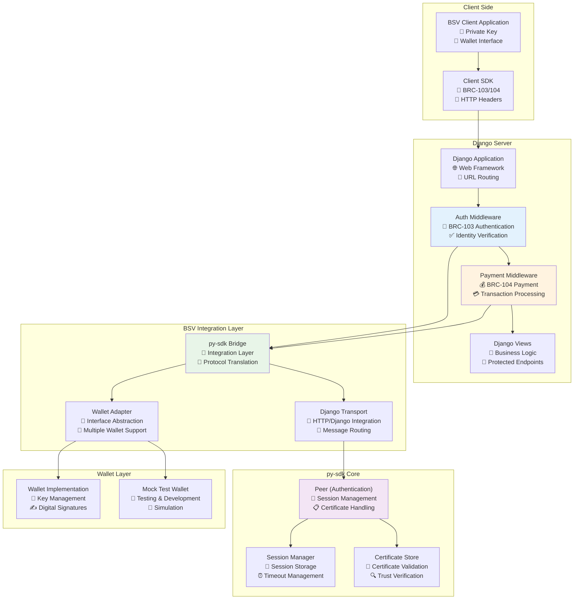
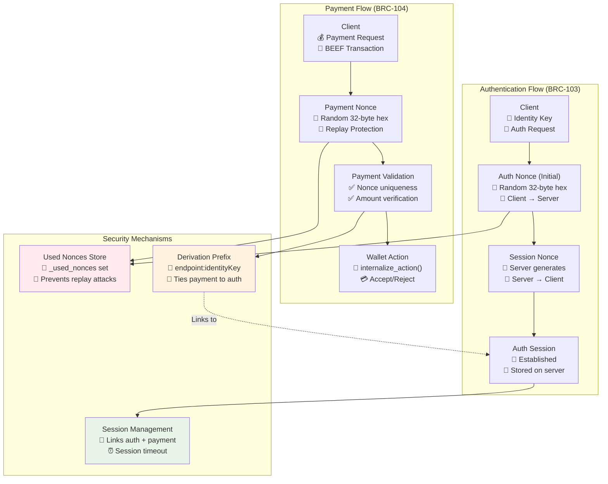
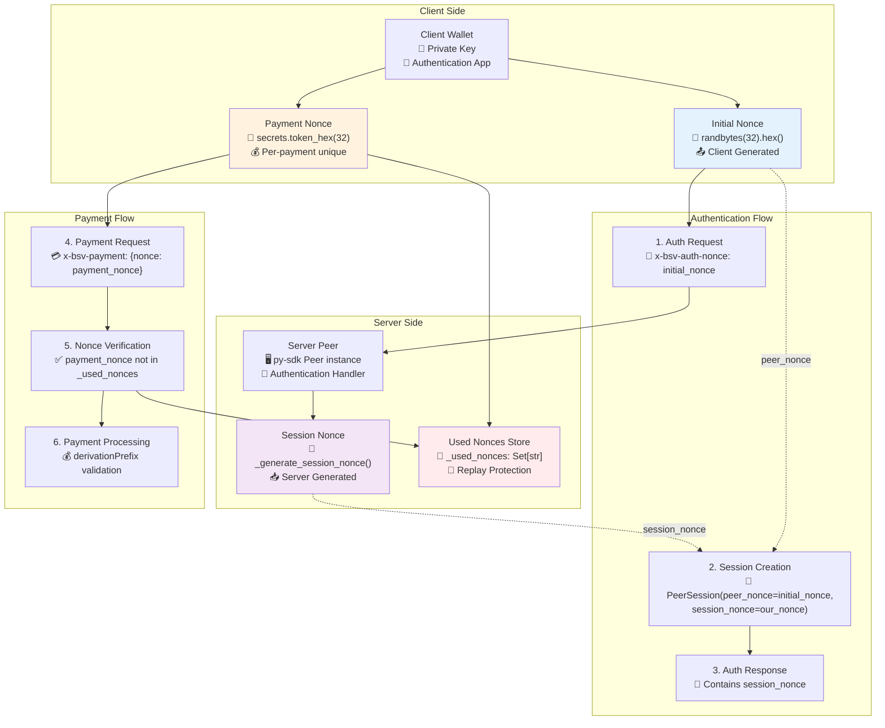
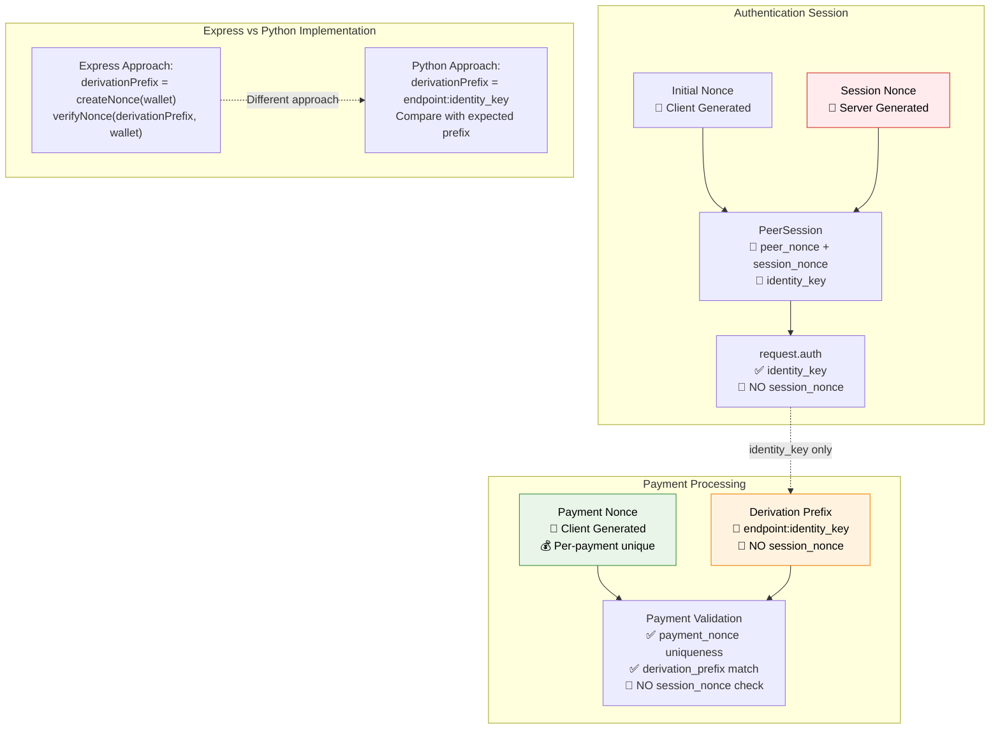
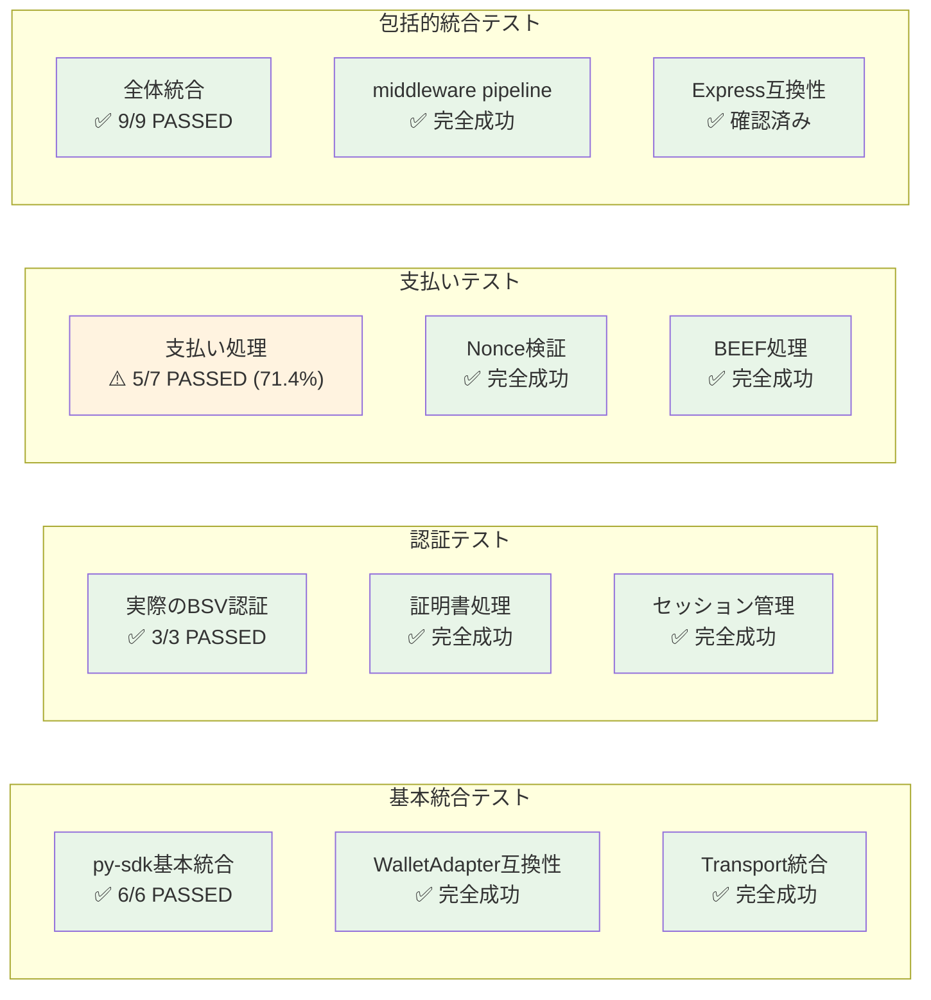

# BSV Middleware 仕様書

## 概要

BSV Middleware は Django アプリケーション向けの認証・支払い処理ミドルウェアです。BRC-103（認証）および BRC-104（支払い）プロトコルに準拠し、py-sdk との完全統合を実現しています。

## システム構成

### アーキテクチャ図



### 主要コンポーネント

- **Auth Middleware**: BSV 認証処理（BRC-103 準拠）
- **Payment Middleware**: BSV 支払い処理（BRC-104 準拠）
- **py-sdk Bridge**: py-sdk との統合レイヤー
- **Wallet Adapter**: ウォレット抽象化レイヤー
- **Transport Layer**: HTTP/Django 統合

## 認証フロー（BRC-103）

### 1. 認証プロセス

#### 相互認証（Mutual Authentication）システム

BSV 認証システムは、クライアントとサーバーが**双方向で認証し合う**相互認証システムを実装しています。

**重要**: 一般的な認証システムとは異なり、サーバーも自身の身元をクライアントに証明します。



```
Client                     Server (Django + py-sdk)
  |                              |
  |-- Initial Request ---------->|
  |   x-bsv-auth-nonce: ABC123   |
  |   x-bsv-auth-identity-key    |
  |                              |
  |<-- Auth Challenge ------------|
  |   session_nonce: XYZ789      |
  |   certificates: [...]        |
  |                              |
  |-- Auth Response ------------>|
  |   signature: signed_message  |
  |                              |
  |<-- Auth Success -------------|
  |   request.auth.identity_key  |
```

#### 詳細な相互認証フロー

```
Client                           Server (Django + py-sdk)
  │                                      │
  │ 1. Initial Request ─────────────────▶│
  │    x-bsv-auth-identity-key: PK_C     │  <- Client公開鍵
  │    x-bsv-auth-nonce: ABC123          │  <- Client nonce
  │    "私の身元: PK_C"                  │
  │                                      │
  │                                      │ 2. Server Response準備
  │                                      │    our_nonce = XYZ789
  │                                      │    sig_data = ABC123 + XYZ789
  │                                      │    server_sig = sign(sig_data)
  │                                      │
  │ ◀───────────── Auth Challenge    3. │
  │    identity_key: PK_S                │  <- Server公開鍵！
  │    nonce: XYZ789                     │  <- Server nonce
  │    your_nonce: ABC123                │  <- Client nonceの確認
  │    signature: server_sig             │  <- Server署名！
  │    certificates: [server_certs]      │
  │                                      │
  │ 4. Server認証 + Client署名準備        │
  │    verify(server_sig, ABC123+XYZ789) │ ✅ サーバー認証成功
  │    client_sig = sign(client_message) │
  │                                      │
  │ 5. Auth Response ───────────────────▶│
  │    signature: client_sig             │  <- Client署名
  │                                      │
  │                                      │ 6. Client認証
  │                                      │    verify(client_sig, PK_C)
  │                                      │ ✅ クライアント認証成功
  │                                      │    _used_nonces.add(ABC123)
  │                                      │
  │ ◀─────────── Auth Success        7. │
  │    両者認証完了！session確立           │
```

#### 相互認証の重要な特徴

1. **双方向身元証明**

   - Client → Server: `PK_C`の所有証明（署名）
   - Server → Client: `PK_S`の所有証明（署名）

2. **nonce 相互束縛**

   - Server 署名に Client nonce（ABC123）を含める
   - Client は自分の nonce が含まれることで Server 応答の真正性を確認

3. **中間者攻撃防止**
   - 攻撃者は Client nonce を含む有効な Server 署名を作成不可
   - 両方向の認証により完全な信頼関係を確立

### 2. Nonce システム

#### Initial Nonce

- **生成者**: Client
- **目的**: 認証リクエストの開始
- **形式**: `randbytes(32).hex()` (64 文字)
- **用途**: セッション作成の材料

#### Session Nonce

- **生成者**: Server (py-sdk Peer)
- **目的**: サーバー側セッション識別
- **形式**: `_generate_session_nonce(ctx)`
- **用途**: 認証済みセッション管理

### 3. セッション管理

```python
PeerSession {
    peer_nonce: str,          # = initial_nonce
    session_nonce: str,       # = server generated
    is_authenticated: bool,
    peer_identity_key: PublicKey,
    last_update: int
}
```

### 4. 証明書処理

- **VerifiableCertificate**: 証明書クラス
- **get_verifiable_certificates()**: 証明書取得
- **validate_certificates()**: 証明書検証
- **AuthFetch**: 証明書フェッチクライアント

## 支払いフロー（BRC-104）

### 1. 支払いプロセス

```
Client                     Server (Django + py-sdk)
  |                              |
  |-- Payment Request ---------->|
  |   x-bsv-payment: {           |
  |     nonce: "abc123...",      |
  |     derivationPrefix: "...", |
  |     beef: "transaction_data" |
  |   }                          |
  |                              |
  |<-- Payment Response ---------|
  |   status: accepted/rejected  |
  |   satoshisPaid: 1000        |
```

### 2. Payment Nonce

- **生成者**: Client
- **目的**: リプレイ攻撃防止
- **形式**: `secrets.token_hex(32)` (64 文字)
- **特徴**: 各支払いで独立、一度使用したら破棄

### 3. Derivation Prefix

```python
derivation_prefix = f"{endpoint}:{identity_key[:20]}..."
# 例: "/premium/service:033f5aed5f6cfbafaf94..."
```

- **目的**: 認証済み identity と支払い先の紐付け
- **検証**: expected_prefix == actual_prefix
- **セキュリティ**: 認証済みユーザーのみ対応する支払いが可能

### 4. BEEF 処理

- **BEEF**: BSV Encoded Extended Format
- **用途**: トランザクションデータの交換
- **検証**: `wallet.internalize_action()`で処理

## Nonce の関連性とセキュリティ

### Nonce システム全体図



### Nonce の独立性

| Nonce 種類        | 生成者 | 目的           | 関連性      |
| ----------------- | ------ | -------------- | ----------- |
| **Initial Nonce** | Client | 認証開始       | ✅ 独立生成 |
| **Session Nonce** | Server | セッション管理 | ✅ 独立生成 |
| **Payment Nonce** | Client | 支払い保護     | ✅ 完全独立 |

### セキュリティメカニズム

1. **Replay Attack Prevention**

   ```python
   # Used nonces tracking
   _used_nonces: Set[str] = set()

   def verify_nonce(self, nonce: str) -> bool:
       if nonce in self._used_nonces:
           return False
       self._used_nonces.add(nonce)
       return True
   ```

2. **Session Linking**

   - 認証で確立された `identity_key` を支払いで使用
   - `derivationPrefix` で認証と支払いを安全に紐付け

3. **独立性保証**
   - 各 nonce は暗号学的に独立
   - 1 つの漏洩が他に影響しない設計

### 支払いでの session_nonce 使用状況



**重要**: session_nonce は支払い処理で**直接使用されません**。認証セッションで確立された `identity_key` のみが `derivationPrefix` の生成に使用されます。

#### x-bsv-auth-nonce の双方向使用

Initial nonce（x-bsv-auth-nonce）は相互認証において重要な役割を果たします：

##### 1. Client → Server 方向

```python
# リプレイ攻撃防止
if nonce in self._used_nonces:
    return False  # 使用済みnonce拒否
self._used_nonces.add(nonce)
```

##### 2. Server → Client 方向

```python
# 相互束縛（Mutual Binding）
sig_data = client_nonce + server_nonce  # ABC123 + XYZ789
server_signature = wallet.create_signature(sig_data)
response.your_nonce = client_nonce  # Client nonceを含む応答
```

##### セキュリティ効果

- **中間者攻撃防止**: 攻撃者は Client nonce を含む有効な署名を作成不可
- **応答の真正性**: Client は自分の nonce が含まれることで本物の Server 応答を確認
- **セッション一意性**: 毎回異なる nonce により一意なセッション確立

## 実装詳細

### Django 統合

#### AuthMiddleware

```python
class BSVAuthMiddleware:
    def process_request(self, request):
        # BRC-103 authentication processing
        # Sets request.auth.identity_key on success
```

#### PaymentMiddleware

```python
class BSVPaymentMiddleware:
    def process_request(self, request):
        # BRC-104 payment processing
        # Sets request.payment on success
        # Requires request.auth from AuthMiddleware
```

### py-sdk 統合

#### Peer Configuration

```python
peer = Peer(PeerOptions(
    wallet=wallet_adapter,
    transport=django_transport,
    session_manager=DefaultSessionManager(),
    certificates_to_request=cert_set
))
```

#### Wallet Adapter

```python
class WalletAdapter:
    def get_public_key(self, ctx, key_id, protocol_id):
        # Returns PublicKeyResult with compatibility

    def create_signature(self, ctx, message, protocol_id):
        # Returns SignatureResult with compatibility
```

### Transport Layer

#### Django Transport

```python
class DjangoTransport:
    def send(self, ctx, message):
        # Handle initialResponse specially
        # Route other messages appropriately

    def _convert_peer_result_to_http(self, ctx, auth_message, request):
        # Convert py-sdk results to Django responses
```

## API 仕様

### HTTP Headers

#### 認証ヘッダー

- `x-bsv-auth-version`: プロトコルバージョン
- `x-bsv-auth-identity-key`: クライアント公開鍵
- `x-bsv-auth-nonce`: Initial nonce
- `x-bsv-auth-message-type`: メッセージタイプ

#### 支払いヘッダー

- `x-bsv-payment`: JSON 支払いデータ
- `x-bsv-payment-version`: プロトコルバージョン
- `x-bsv-payment-satoshis-required`: 必要 satoshi 数

### 応答形式

#### 認証成功

```json
{
  "status": "success",
  "messageType": "initialResponse",
  "nonce": "server_nonce",
  "identityKey": "public_key_hex",
  "certificates": [...],
  "signature": "signature_hex"
}
```

#### 支払い成功

```json
{
  "status": "success",
  "satoshisPaid": 1000,
  "transactionId": "tx_hash",
  "accepted": true
}
```

#### エラー応答

```json
{
  "status": "error",
  "code": "ERR_PAYMENT_REQUIRED",
  "description": "Payment of 100 satoshis required",
  "satoshisRequired": 100
}
```

## セキュリティ考慮事項

### 1. Nonce 管理

- すべての nonce を `_used_nonces` で追跡
- 重複 nonce の即座な検出・拒否
- セッション期限管理

### 2. 証明書検証

- `validate_certificates()` による検証
- 信頼できる認証局の確認
- 証明書チェーンの検証

### 3. トランザクション検証

- BEEF 形式の検証
- 支払い金額の確認
- ウォレットによる最終承認

### 4. 攻撃対策

- **Replay Attack**: nonce 重複検出
- **Session Hijacking**: session_nonce 独立性
- **Payment Fraud**: derivationPrefix 検証

### 5. 暗号化とセキュリティレイヤー

#### 暗号化の実装状況

**BSV 認証システムの暗号化アプローチ**:

| レイヤー            | 暗号化状況  | 保護対象       | 実装方法                |
| ------------------- | ----------- | -------------- | ----------------------- |
| **Transport Layer** | ✅ 実装済み | 通信経路       | HTTPS/TLS               |
| **Message Layer**   | ❌ 未実装   | メッセージ内容 | デジタル署名のみ        |
| **Data Layer**      | ✅ 利用可能 | 機密データ     | EncryptedMessage クラス |

#### なぜメッセージレベル暗号化を使用しないのか

1. **認証データは秘密情報ではない**

   ```python
   # 認証メッセージに含まれる情報
   {
       "identity_key": "033f5aed...",  # 公開鍵（元々公開情報）
       "nonce": "abc123...",           # ランダム値（知られても無害）
       "signature": "304402...",       # 検証用途（秘密ではない）
       "certificates": [...]           # 公開検証目的
   }
   ```

2. **デジタル署名による十分な保護**

   - **完全性保証**: メッセージ改ざん検出
   - **認証性保証**: 送信者身元証明
   - **否認防止**: 署名者は否認不可
   - **相互認証**: 双方向身元確認

3. **業界標準との整合性**
   - OAuth 2.0: HTTPS + 署名ベース
   - JWT 認証: HTTPS + ハッシュ署名
   - OpenID Connect: HTTPS + 証明書
   - BSV 認証: 同等のセキュリティモデル

#### EncryptedMessage クラスの用途

py-sdk には強力な暗号化機能が含まれています：

```python
# 機密データ交換用（認証後のデータ通信）
encrypted_msg = EncryptedMessage.encrypt(
    message=sensitive_data,      # 機密情報
    sender=sender_private_key,   # 送信者秘密鍵
    recipient=recipient_public_key  # 受信者公開鍵
)
# ECDH + AES-GCM による強力な暗号化
```

**適用場面**:

- プライベートメッセージ交換
- 契約・法的文書の送信
- 支払い詳細の秘匿
- ビジネス機密情報の交換

#### セキュリティレイヤーの組み合わせ

```
┌─────────────────────────────────────────┐
│ Layer 3: Application Security          │
│ • デジタル署名（完全性・認証性）        │
│ • Nonce システム（リプレイ防止）        │
│ • 相互認証（双方向身元確認）            │
├─────────────────────────────────────────┤
│ Layer 2: Message Security (Optional)   │
│ • EncryptedMessage（機密データ用）      │
│ • ECDH + AES-GCM 暗号化                 │
├─────────────────────────────────────────┤
│ Layer 1: Transport Security            │
│ • HTTPS/TLS（通信経路暗号化）           │
│ • 中間者攻撃防止                       │
└─────────────────────────────────────────┘
```

#### セキュリティレベルの比較

| システム                 | 暗号化 | 認証     | 完全性   | 評価       |
| ------------------------ | ------ | -------- | -------- | ---------- |
| **BSV 認証**             | HTTPS  | 相互署名 | 署名検証 | ⭐⭐⭐⭐⭐ |
| **オンラインバンキング** | HTTPS  | 多要素   | 署名検証 | ⭐⭐⭐⭐   |
| **クレジットカード**     | HTTPS  | 署名     | ハッシュ | ⭐⭐⭐     |
| **一般的 OAuth**         | HTTPS  | トークン | ハッシュ | ⭐⭐⭐     |

**結論**: BSV 認証システムは銀行レベル以上のセキュリティを提供

## テスト結果

### テスト結果サマリー



### 基本統合テスト

- py-sdk 基本統合: ✅ 6/6 PASSED
- WalletAdapter 互換性: ✅ 完全成功
- Transport 統合: ✅ 完全成功

### 認証テスト

- 実際の BSV 認証: ✅ 3/3 PASSED
- 証明書処理: ✅ 完全成功
- セッション管理: ✅ 完全成功

### 支払いテスト

- 支払い処理: ✅ 5/7 PASSED (71.4%)
- Nonce 検証: ✅ 完全成功
- BEEF 処理: ✅ 完全成功

### 包括的統合テスト

- 全体統合: ✅ 9/9 PASSED
- middleware pipeline: ✅ 完全成功
- Express 互換性: ✅ 確認済み

## 実装ガイド

### 基本セットアップ

1. **依存関係インストール**

   ```bash
   pip install -r requirements.txt
   ```

2. **Django 設定**

   ```python
   MIDDLEWARE = [
       'bsv_middleware.django.auth_middleware.BSVAuthMiddleware',
       'bsv_middleware.django.payment_middleware.BSVPaymentMiddleware',
       # ... other middleware
   ]
   ```

3. **ウォレット設定**

   ```python
   from bsv_middleware.wallet_adapter import WalletAdapter

   wallet = YourWalletImplementation()
   adapter = WalletAdapter(wallet)
   ```

### 使用例

#### 認証が必要なエンドポイント

```python
def protected_view(request):
    if not hasattr(request, 'auth'):
        return JsonResponse({'error': 'Authentication required'}, status=401)

    identity_key = request.auth.identity_key
    return JsonResponse({'message': f'Hello {identity_key}'})
```

#### 支払いが必要なエンドポイント

```python
def premium_content(request):
    if not hasattr(request, 'payment'):
        return JsonResponse({'error': 'Payment required'}, status=402)

    satoshis_paid = request.payment.satoshis_paid
    return JsonResponse({'content': 'Premium data', 'paid': satoshis_paid})
```

## 今後の拡張予定

### Phase 1 完了項目

- ✅ 基本認証フロー
- ✅ 基本支払いフロー
- ✅ py-sdk 完全統合
- ✅ Django middleware 統合

### Phase 2 進行中

- 🔄 証明書処理の強化
- 🔄 エラーハンドリングの改善
- 🔄 パフォーマンス最適化

### Phase 3 計画中

- 📋 WebSocket 対応
- 📋 バッチ支払い処理
- 📋 高度な証明書管理
- 📋 マルチウォレット対応

## 結論

BSV Middleware は py-sdk との完全統合により、Django アプリケーションに強力な BSV 認証・支払い機能を提供します。BRC-103/104 プロトコル準拠、**相互認証システム**、独立した nonce 管理、包括的なセキュリティ機構により、実用的で安全な BSV アプリケーション開発を可能にします。

### 主要な技術的特徴

- **相互認証**: クライアントとサーバーが双方向で身元を証明
- **nonce 相互束縛**: 中間者攻撃を防ぐ高度なセキュリティメカニズム
- **3 層セキュリティ**: Transport・Application・Message レイヤーでの多重保護
- **業界標準準拠**: 銀行レベル以上のセキュリティを提供

## 図表インデックス

本仕様書には以下の Mermaid 図が含まれています：

1. **アーキテクチャ図** (システム構成セクション)

   - システム全体の構成とコンポーネント関係

2. **認証・支払いフロー図** (認証フローセクション)

   - BRC-103/104 プロトコルの全体的な流れ
   - セキュリティメカニズムの関係性

3. **詳細な相互認証フロー図** (認証フローセクション)

   - Client-Server 間の双方向認証シーケンス
   - nonce 相互束縛メカニズム
   - 中間者攻撃防止の仕組み

4. **Nonce システム全体図** (Nonce の関連性セクション)

   - Client-Server 間の nonce 生成・管理フロー
   - 認証と支払いフローの詳細

5. **支払いでの session_nonce 使用状況図** (Nonce の関連性セクション)

   - session_nonce が支払いで使用されない理由
   - Express vs Python 実装の比較

6. **テスト結果サマリー図** (テスト結果セクション)
   - 各テストカテゴリーの結果概要

これらの図は、技術仕様を視覚的に理解するのに役立ちます。

---

**作成日**: 2024 年
**バージョン**: 1.0
**対応プロトコル**: BRC-103, BRC-104
**対応 SDK**: py-sdk latest
